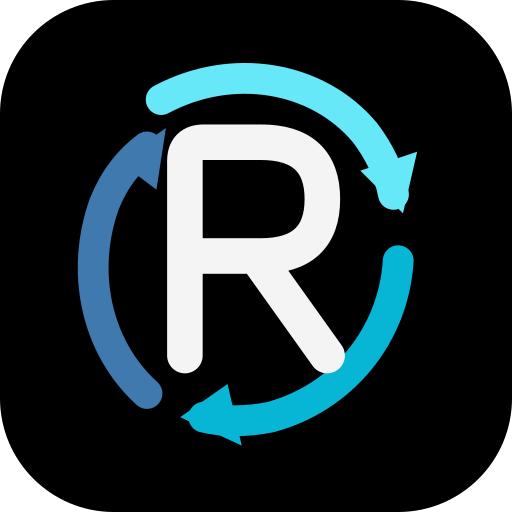

# Bilinen sorunlar / Known unresolved issues — yardım aranıyor

**Google Drive aktarımı güvenilir çalışmıyor. Proje topluluk katkılarına ve bağımsız forklarla devam edilmesine açıktır. Bu sürümleri güvenilir bir yedekleme aracı olarak sunmuyoruz.**

- **Yükleme takılması çözülmedi:** tüm byte miktarı %100'e ulaştığı halde bir veya iki dosya rclone içinde aktarılıyor olarak kalabiliyor; uygulama %99'da bekliyor. Son cihaz testinde 47.535 MiB işlendi, fakat yaklaşık 1 dakika 38 saniye sonunda tamamlanan dosya sayısı hâlâ `0 / 2` idi; kullanıcı işlemi durdurdu.
- **Sayaç/hedef uyuşmazlığı:** kullanıcı 800 MB işlenmiş görünürken Drive'da yalnızca 14 MB dosya gördüğünü ve başka bir denemede tamamlanan dosya sayısının hedefle uyuşmadığını bildirdi. Bu raporların kesin nedeni doğrulanmadı. İşlenen byte, tamamlanan dosya ve Drive'da gerçekten bulunan dosya aynı şey değildir.
- **Stop ve diğer son düzeltmeler:** Stop'un uygulamayı kapatması için kod değiştirildi ve yerel testler geçti; cihazda sorunun kesin giderildiğine dair ayrı teyit yok. İlerleme/bildirim, modal kenarlıkları ve kısayollar da değiştirilmiş olsa da tüm cihaz senaryoları doğrulanmadı.
- **Google Drive kimliği:** cihaz logu hâlâ rclone'un ortak `client_id` kimliğinin kullanıldığını bildiriyor. Uyarı mevcut; bunun yükleme takılmasının nedeni olduğu kanıtlanmadı.
- **Eski APK güncellemesi:** Build #20 imza anahtarı yapılandırılmış CI önbelleğinden geri alınamadı. Farklı anahtarla imzalanan APK aynı uygulamanın üzerine kurulamaz. Verileri silmek çözüm olarak önerilmemeli.

**Derleme başarısı, OAuth bağlantısı veya yerel dosya kopyalama testi, Android → Google Drive yüklemesinin çalıştığının kanıtı değildir.**

English: Drive uploads remain unresolved. Processed bytes can reach 100% without file completion; destination/counter discrepancies are reported. Contributors and forks are welcome. See the evidence, attempted fixes and verification limits below.

- [Açık aktarım sorunu / upload issue #2](https://github.com/250siparis-code/BasicRcloneFlow/issues/2)
- [Geliştirici devir belgesi / developer handoff](HANDOFF.md)
- [Katkı ve fork rehberi / contributing](CONTRIBUTING.md)
- [En güncel deneysel kod / latest experimental source](https://github.com/250siparis-code/BasicRcloneFlow/tree/fix/drive-setup-lifecycle) — **2.1.4**, commit `ba05d294ef50be50c6c7dbe39e8f5faec2e903f7`, [draft PR #1](https://github.com/250siparis-code/BasicRcloneFlow/pull/1).

`main` contains the earlier **2.1.0 / Build #20** code plus these handoff documents. The experimental changes are available for review and continuation; they are not presented as a solved Drive uploader. Google Drive setup/OAuth was confirmed working by the user on the experimental branch, while the original setup dialog problem remains relevant to `main`.

---

<p align="center">
  
</p>

<h1 align="center">Basic Rclone Flow</h1>

<p align="center">
  A focused AMOLED Android front end for running real rclone workflows as reusable task cards.
</p>

<p align="center">
  
  
  
  
  
</p>

> **Current cloud scope:** Google Drive only. Local Android storage is supported as a source or destination. Other rclone cloud backends are intentionally not bundled yet.

## Why Basic Rclone Flow

Basic Rclone Flow is not a file manager and it does not simulate rclone. Each card stores a real rclone command and runs the bundled Android ARM64 rclone engine. The app is designed for repeatable personal flows such as phone-to-Drive backup, Drive-to-phone restore, folder sync, copy, move, checks and scheduled jobs.

The interface stays deliberately small: create a card, configure the command, run it, and watch the real transfer state.

## Highlights

- Pure AMOLED black Jetpack Compose interface
- AMOLED-black adaptive launcher icon and custom notification icon
- Animated screen transitions
- Editable task cards with custom title, built-in icon and command
- Real rclone execution through the bundled **rclone v1.75.1** engine
- Live percentage, bytes, transfer count, speed, ETA, current file and logs
- Modern in-card progress with a persistent Completed state
- 72-hour activity history with date, time, duration and result
- Android foreground `dataSync` service with wake lock for long operations
- Pause, resume, stop and single-job queue
- Exact daily scheduling
- Per-card home-screen shortcuts
- App-private `rclone.conf` with import/export
- Native Google Drive setup driven by rclone's own persistent RC configuration protocol
- OAuth browser flow with return-to-app deep link
- Post-setup live Google Drive verification before the app reports success
- Google Drive remote management: **Test / Edit / Delete**
- Card backup and full-app backup
- No prefilled demo cards
- ARM64-only, minified Android release

## Google Drive setup

Open:

```text
Settings → Google Drive → Google Drive Setup
```

Basic Rclone Flow starts a local rclone RC service bound to:

```text
127.0.0.1:5572
```

The setup UI does **not** invent Google Drive fields. It uses rclone's native configuration state machine:

```text
config/create
  ↓
State + Option returned by rclone
  ↓
user answer
  ↓
config/update + continue + state + result
  ↓
next rclone question
  ↓
config/oauthstatus
  ↓
Google OAuth in browser
  ↓
basic-rclone-flow://oauth return
  ↓
live "rclone lsd remote:" verification
```

Client ID, Client Secret, scope / Full Access, Service Account, Shared Drive and related options are therefore supplied by the bundled rclone version itself.

A setup is only shown as **connected and verified** after a real Google Drive root listing succeeds. If authorization was saved but the live check fails, the setup screen keeps that distinction visible and allows a retry.

## Manage Google Drive

```text
Settings → Google Drive → Manage Google Drive
```

For each configured Drive remote:

- **Test** — run a live Drive connectivity check
- **Edit** — edit that remote's own rclone config block
- **Delete** — remove the remote from `rclone.conf`

OAuth tokens inside `rclone.conf` are credentials. Do not publish config files or full-app backups.

## Task cards

A new installation starts with an empty task list. Use **+** to create your own card.

Example command syntax:

```bash
rclone copy "/storage/emulated/0/DCIM/Camera/" "gdrive:Backups/Camera/"
```

The experimental branch removes terminal `--progress` / `-P` flags and uses periodic JSON statistics with a fallback for text reports. Its completed-file counter is separate from processed bytes.

When needed, these options are added automatically:

```text
--config <app-private rclone.conf>
--cache-dir <app-private cache>
--use-json-log
--stats 1s
--stats-log-level NOTICE
--log-level INFO
```

## Permissions

**All files access** is needed for broad local-storage workflows. Android can still restrict special areas such as `/Android/data` and `/Android/obb`.

**Notifications** are used by foreground transfers and optional completion alerts.

**Exact alarms** are only needed for exact daily schedules.

## Import an existing Termux configuration

Inside the app:

```text
Settings → Rclone → Import from Termux
```

Or run directly in Termux:

```bash
CFG="$(rclone config file | tail -n 1)"
cp "$CFG" ~/storage/downloads/rclone.conf
```

Then choose **Import rclone.conf** in Basic Rclone Flow.

## Build

Every push to `main` runs the Android workflow:

1. JDK 17
2. Go
3. Android SDK 35 / NDK 27.2
4. rclone v1.75.1 compiled for Android ARM64
5. minified release APK
6. GitHub Actions artifact upload

Main branch app version: **2.1.0** (earlier Build #20 source) — latest experimental version: **2.1.4** in PR #1<br>
Current ABI: **arm64-v8a**

See [PHONE_BUILD.md](PHONE_BUILD.md) for a phone-only build workflow and [VALIDATION.md](VALIDATION.md) for the release checklist.

## Architecture

- Kotlin
- Jetpack Compose
- Android foreground service
- rclone RC for Google Drive configuration
- rclone CLI execution for task jobs and verification
- app-private `rclone.conf`
- JSON log/stat parsing
- AlarmManager scheduling
- SharedPreferences + JSON persistence
- R8 minification and resource shrinking

## Project status

Development is open for community continuation. The Drive upload defect remains unresolved; see the warning at the top and [HANDOFF.md](HANDOFF.md).

The normal package is `dev.galaxy.rclonecards`; the experimental isolated package is `dev.galaxy.rclonecards.drivetest`. An upgrade requires both a matching package ID and signing certificate. Independent fork builds do not automatically inherit the signing key of an installed APK.

## Credits

Basic Rclone Flow is created by **BlackWare** with **OpenAI ChatGPT**.

rclone is an independent open-source project by Nick Craig-Wood and contributors.

## License

This project is MIT licensed. The bundled rclone engine is also distributed under the MIT License. See [NOTICE.md](NOTICE.md) and [RCLONE_LICENSE.txt](RCLONE_LICENSE.txt).
